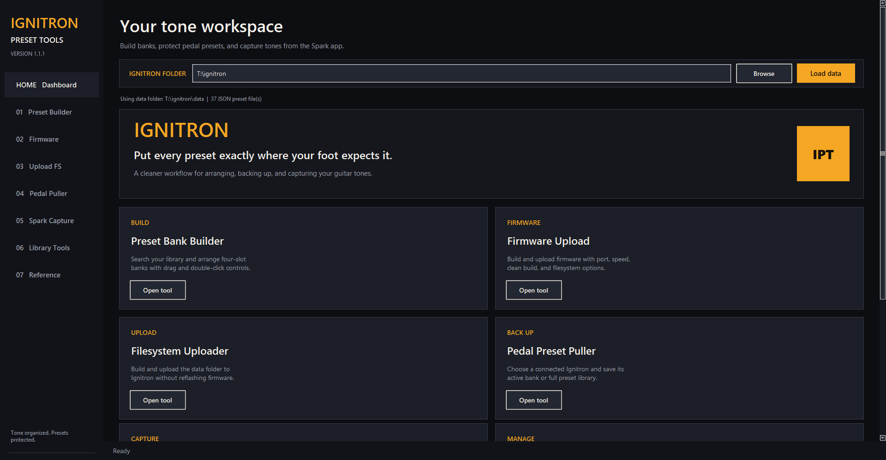
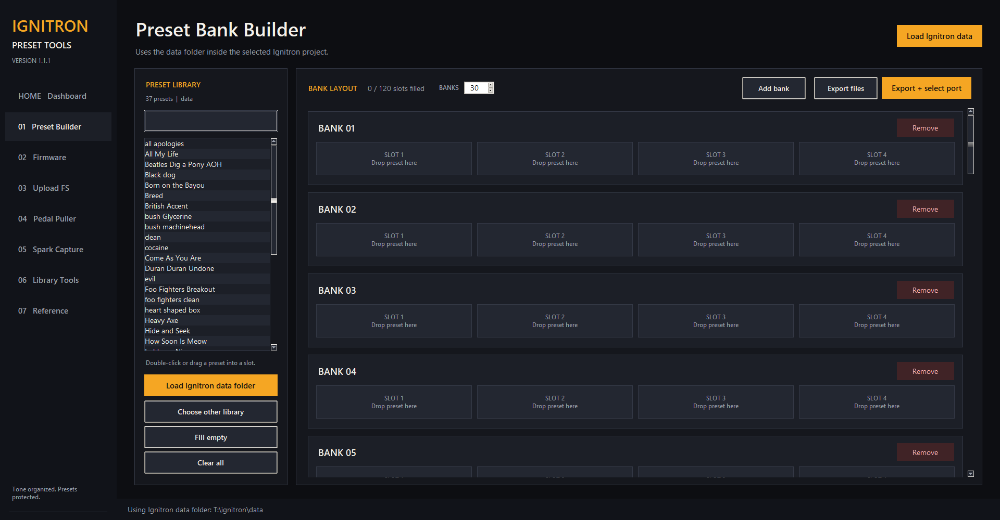
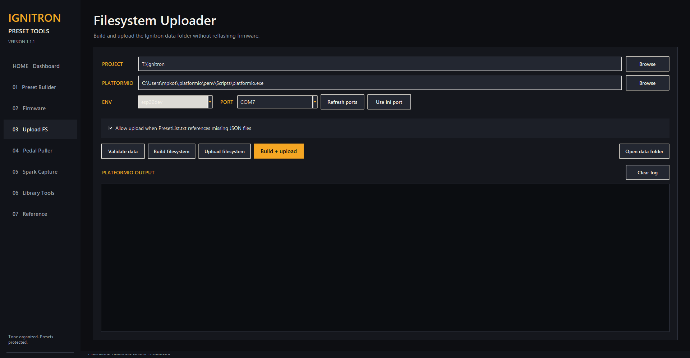
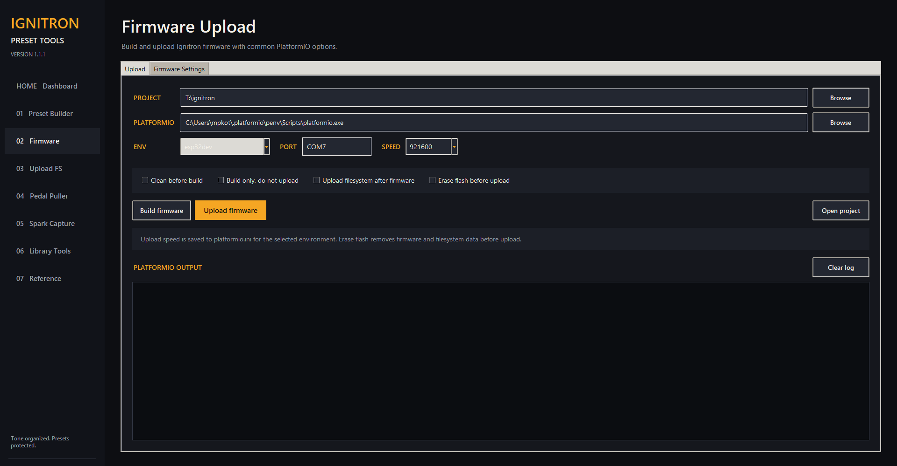
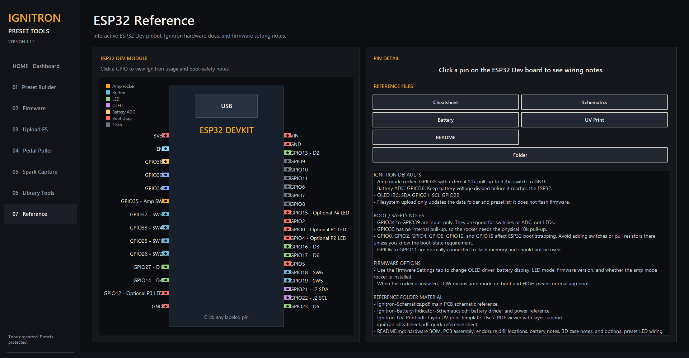

# Ignitron Preset Tools v1.1.1

Ignitron Preset Tools is a Windows and macOS desktop app for managing
[Ignitron](https://github.com/stangreg/Ignitron) preset banks for Positive Grid
Spark amps. It helps you build pedal-ready preset banks, upload only the ESP32
filesystem, back up presets from the pedal, capture presets from the Spark app,
and adjust common firmware settings from one place.



## Downloads

Download the latest packaged app from the GitHub Release page:

[Ignitron Preset Tools v1.1.1 release](https://github.com/mpkottawa/ignitron-preset-tools-v1.1.1/releases/tag/v1.1.1)

Direct downloads:

- [Windows zip](https://github.com/mpkottawa/ignitron-preset-tools-v1.1.1/releases/download/v1.1.1/Ignitron.Preset.Tools.v1.1.1-windows.zip)
- [macOS zip](https://github.com/mpkottawa/ignitron-preset-tools-v1.1.1/releases/download/v1.1.1/Ignitron.Preset.Tools.v1.1.1-macos.zip)

The Ignitron firmware project is not bundled. Download or clone the firmware
separately, then choose that folder from the app dashboard.

## What The App Does

- Builds `PresetList.txt` and `PresetListUUIDs.txt` from a visual bank layout.
- Generates a printable `PresetList.pdf` setlist chart.
- Uploads only the LittleFS filesystem/data folder to the ESP32.
- Uploads firmware when you intentionally choose the Firmware tab.
- Backs up presets from a connected Ignitron pedal.
- Captures presets streamed from the Spark app.
- Provides firmware option editors for display, battery, LED, and amp rocker settings.
- Includes an interactive ESP32/Ignitron pin reference with schematic files.

## Requirements

Required:

- Windows 10/11 or macOS
- PlatformIO Core
- Ignitron firmware project downloaded separately
- ESP32 connected with a USB data cable

Usually required on Windows:

- CH340/CH341 USB serial driver for many generic ESP32 boards
- CP210x USB serial driver for Silicon Labs USB-to-serial boards

The first PlatformIO build or upload may require internet access so PlatformIO
can download the ESP32 platform, toolchain, and Arduino libraries.

## Installation

### Windows

1. Download the Windows zip from the release page.
2. Extract the whole zip.
3. Run `Ignitron Preset Tools v1.1.1.exe`.
4. Keep the `_internal` folder beside the exe. The app needs it.

To put the app on your desktop, create a shortcut to the exe instead of moving
the exe by itself.

### macOS

1. Download the macOS zip from the release page.
2. Extract the zip.
3. Open `Ignitron Preset Tools v1.1.1.app`.

The macOS app is unsigned. If macOS blocks it the first time, right-click the
app, choose **Open**, then confirm.

## First-Time Setup

Open the app and choose your Ignitron firmware folder on the Dashboard.

The selected folder should contain:

```text
Ignitron/
  platformio.ini
  data/
  src/
  Ignitron.ino
```

The app uses the selected firmware folder throughout the project. Presets are
read from and exported to the firmware folder's `data` directory.


## Preset Bank Builder

The Preset Bank Builder is the main workflow for arranging the pedal banks.



How to use it:

1. Click **Load Ignitron data folder** to use the selected firmware project's
   `data` folder.
2. Search the preset library on the left.
3. Double-click a preset or drag it into a bank slot.
4. Use **BANKS** to choose how many banks to build. The default is 30 banks.
5. Use **Export files** to write:
   - `PresetList.txt`
   - `PresetListUUIDs.txt`
   - `PresetList.pdf`
6. Use **Export + select port** when you are ready to upload the new bank list
   to the pedal.

Notes:

- Each bank has four slots.
- If a bank has fewer than four assigned presets, the export fills remaining
  slots using the last assigned preset in that bank.
- Right-click or double-click a filled slot to clear it.
- The generated PDF opens after export so you can review or print it.

## Upload Filesystem

The Upload FS page builds and uploads only the Ignitron `data` folder. This is
the normal way to update preset banks without reflashing firmware.



Typical workflow:

1. Build your bank layout in Preset Builder.
2. Click **Export + select port**.
3. Choose the ESP32 COM port.
4. Click **Upload filesystem** or **Build + upload**.

The app validates the data folder first. It checks for missing referenced JSON
files in `PresetList.txt` and warns before upload if needed.

Important:

- Filesystem upload does not reflash firmware.
- The pedal must already have compatible Ignitron firmware installed.
- The firmware project should use LittleFS, for example:

```ini
board_build.filesystem = littlefs
```

## Firmware Upload And Settings

The Firmware page is for intentionally building or uploading firmware and for
editing common options in the firmware source.



Firmware upload options include:

- PlatformIO environment
- COM port
- Upload speed
- Clean build
- Build only
- Upload filesystem after firmware
- Erase flash before upload

Firmware settings include:

- Firmware version text
- OLED driver selection
- Battery display settings
- Battery ADC pin and voltage divider values
- FX blink setting
- Dedicated preset LED option
- Amp mode rocker switch option and GPIO pin

Use the Firmware tab carefully. Firmware upload changes the code running on the
ESP32. For normal preset-bank changes, use Upload FS instead.

## Pedal Preset Puller

Pedal Puller backs up presets from a connected Ignitron pedal over serial.

Basic workflow:

1. Connect the Ignitron pedal by USB.
2. Select the COM port.
3. Choose whether to pull the active bank or the full preset library.
4. Start the backup.

Backups are saved under the selected Ignitron folder's backup location. This
feature requires firmware support for serial preset listing commands.

## Spark App Capture

Spark Capture listens for presets sent from the Spark app and saves clean
Ignitron JSON preset files.

Basic workflow:

1. Connect the Ignitron pedal by USB.
2. Select the COM port.
3. Start capture.
4. Send or store presets from the Spark app.
5. Click **End connection** when finished.

Captured presets are saved under the selected Ignitron folder's capture
location.

## Library Tools

Library Tools helps manage a larger preset library separately from a pedal's
active `data` folder.

Use it to:

- Scan a main preset library.
- View preset metadata and raw JSON.
- Find duplicate names.
- Find duplicate UUIDs.
- Send a library into Preset Builder.
- Build live setlists.

## ESP32 Reference

The Reference tab includes an interactive ESP32 Dev pinout, Ignitron wiring
notes, schematic links, and hardware reference material.



Clickable pins show the actual Ignitron schematic mapping, including:

| GPIO | Schematic Part | Function |
| --- | --- | --- |
| GPIO25 | SW1 | P1 / Drive switch |
| GPIO26 | SW2 | P2 / Mod switch |
| GPIO32 | SW3 | P3 / Delay switch |
| GPIO33 | SW4 | P4 / Reverb switch |
| GPIO19 | SW5 | Bank Down / Noise Gate switch |
| GPIO18 | SW6 | Bank Up / Comp switch |
| GPIO27 | D1 | P1 / Drive LED |
| GPIO13 | D2 | P2 / Mod LED |
| GPIO16 | D3 | P3 / Delay LED |
| GPIO14 | D4 | P4 / Reverb LED |
| GPIO23 | D5 | Bank Down / Noise Gate LED |
| GPIO17 | D6 | Bank Up / Comp LED |
| GPIO21 | J2 SDA | OLED SDA |
| GPIO22 | J2 SCL | OLED SCL |

Reference files include:

- Ignitron schematic PDF
- Battery indicator schematic PDF
- UV print PDF
- Ignitron cheatsheet PDF
- Hardware README

## Common Settings

Most users will use:

| Setting | Typical Value |
| --- | --- |
| PlatformIO environment | `esp32dev` |
| Upload speed | `921600` |
| Filesystem | `littlefs` |
| Firmware folder | Your downloaded Ignitron project |
| Preset folder | `Ignitron/data` |

## Troubleshooting

### No COM port appears

- Use a USB data cable, not a charge-only cable.
- Install the correct ESP32 USB serial driver.
- Open Windows Device Manager or macOS System Information to confirm the board
  appears.
- Click **Refresh ports** in the app.

### Filesystem upload fails

- Confirm the selected Ignitron folder contains `platformio.ini`.
- Confirm the selected environment matches your board.
- Try a lower upload speed if your board is unstable.
- Make sure no serial monitor is already connected to the same COM port.

### App opens but upload cannot find PlatformIO

Install PlatformIO Core, then set the PlatformIO path in the app. On Windows it
is commonly:

```text
C:\Users\<user>\.platformio\penv\Scripts\platformio.exe
```

### macOS says the app cannot be opened

The app is unsigned. Right-click the app, choose **Open**, then confirm. If
needed, allow it from **System Settings > Privacy & Security**.

## Project Layout

```text
source/
  ignitron_preset_tools_v1.1.1.py
  preset_chart.py
  preset_converter.py
  preset_puller.py
  preset_app_scraper.py
  reference/

docs/images/
  dashboard.png
  preset-builder.png
  upload-filesystem.png
  firmware-upload.png
  reference.png

.github/workflows/
  release.yml
```

## Building From Source

Install build requirements:

```bash
python -m pip install -r requirements-build.txt
```

Build the packaged app:

```bash
python build_release.py
```

Tagged releases are built automatically by GitHub Actions for Windows and macOS.

## Credits

Ignitron Preset Tools builds on the excellent Ignitron pedal project by
stangreg:

https://github.com/stangreg/Ignitron

This tool was created to make preset-bank editing, backup, capture, and
filesystem upload easier for Ignitron users.
